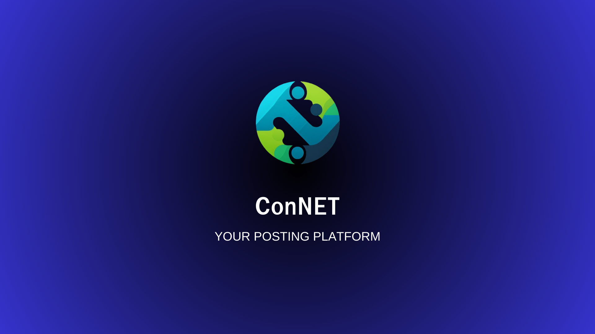

# ConNET

PHP - Laravel Mini Project. In this project, we can CREATE, UPDATE, DELETE, READ posts. Especially praticing on CRUD laravel operation.



## Getting Started

**Clone** the repo

```shell
mkdir Project
cd Project
git clone https://github.com/Hein-HtetSan/ConNET.git
```

Create **.env** file

```shell
cd ConNET
cp .env.example .env
```

Create **Database** in command prompt

```mysql
CREATE DATABASE <DB_NAME>;
USE <DB_NAME>;
```

**Config** in your .env file

```.env
DB_CONNECTION=mysql
DB_HOST=127.0.0.1
DB_PORT=3306
DB_DATABASE=<DB_NAME>
DB_USERNAME=root
DB_PASSWORD=<PASSWORD>
```

Make **migration**

```shell
php artisan migrate
```

Make **Seeding** to insert random data to database

```shell
php artisan db:seed
```

Run the web application

```shell
php artisan serve
```